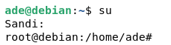
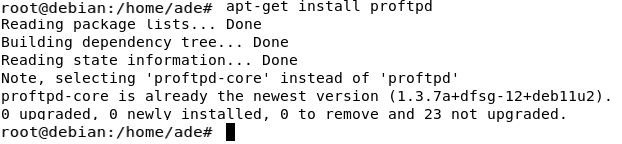
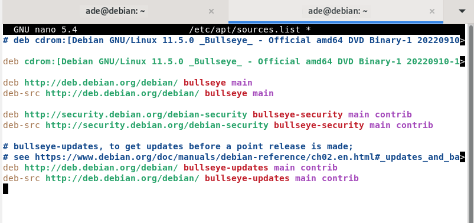
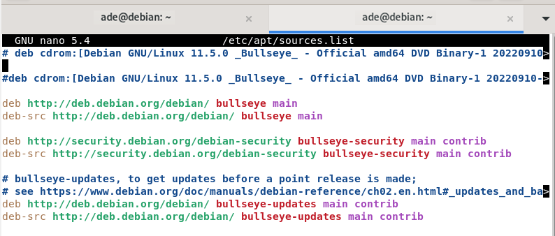
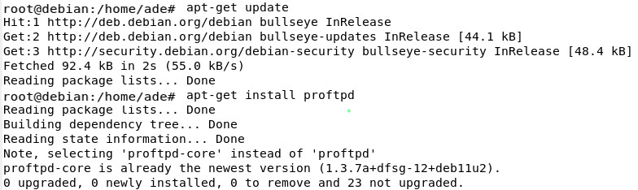
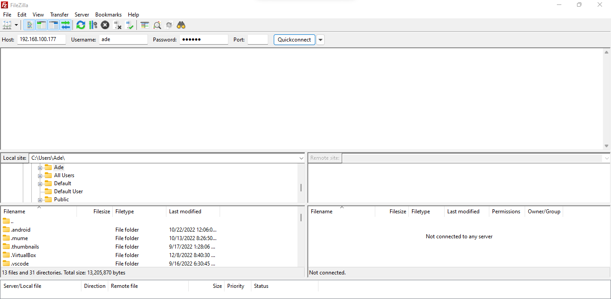
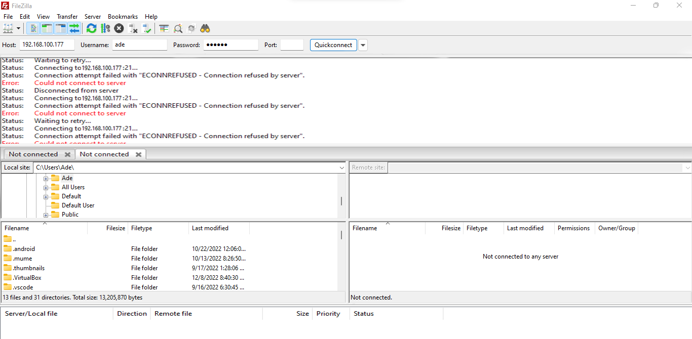
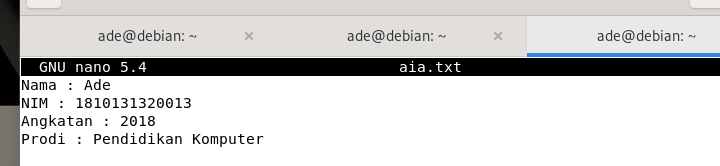

# FTP

langkah - langkah
1.Pertama, jalankan mesin virtual Debian 11 Linux lalu klik mesin virtual Debian 11 kemudian klik tombol mulai.

2.Setelah itu terbuka masukkan kata sandi lalu cari terminal.

3.Lalu tulis su dan masukkan password. 

4.tulis install proftpd dengan menjalankan command apt-get install proftpd.

5.setelah berhasil masukan user command nano /etc/apt/sources.list.

6.kemudian tambahkan tanda # di depan deb cdrom baris ke -2 atau bisa juga text pada baris ke -2 tersebut dihapus. Simpan klik ctrl+s, ctrl+x. 

7.setelah simpan dan jalankan command apt-get update dan coba jalankan lagi command apt-get install proftpd untuk menginstall ulang.

8.setelah itu kita bisa menguji pada proftpd dengan menggunakan aplikasi filezilla yang akan diinstall pada computer client. Untuk itu silahkan download aplikasi tersebut pada <https://filezilla-project.org/download.php> jika sudah diinstall jalankan, maka tampilannya akan sebagai berikut

1.jalankan aplikasi filezilla lalu isi host dengan ip address debian, username dengan nama user debian, password dengan password debian dan port 21.

2.lalu klik quickconnect, tunggu jika berhasil maka akan muncul seperti gambar dibawah ini.

3.kemudian buat file .txt dengan menjalankan command nano saya.txt lalu masukkan data yang akan ditampilkan.

4.setelah selesai simpan dan cek file yang tadi dengan menggunakan ls pada command atau bisa dilihat dari dalam filezilla apakah sudah ada file yang kita buat tadi.
